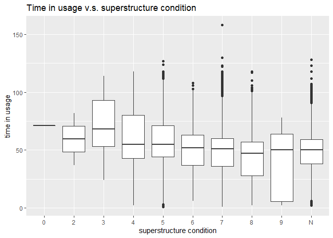

STAT 479 HW1
================

## General Idea

Generally speaking, bridges’ condition should become worse as time in
usage increases. To verify this, I use the 2018 California bridges data
and select the structure number, place code, year built, deck condition,
superstructure condition, substructure condition, location, county code.
Also, I create a new column called Duration to store the time in usage.

Then I plot three boxplots to check the relationship between the deck,
superstructure, substructure condition and time in usage.

According to the three plots, all three kinds of bridge conditions
become worse as time in usage increases.

## Read in and manipulate the data

``` r
# read in and manipulate the 2018 bridges data
bridge_cleaned=read.csv('https://www.fhwa.dot.gov/bridge/nbi/2018/delimited/CA18.txt') %>% 
  select(STRUCTURE_NUMBER_008,PLACE_CODE_004,YEAR_BUILT_027,DECK_COND_058,SUPERSTRUCTURE_COND_059,SUBSTRUCTURE_COND_060,LOCATION_009, COUNTY_CODE_003) %>% 
  mutate(Duration = 2018 - YEAR_BUILT_027) %>% 
  filter(Duration < 200)
```

## Box Plots

``` r
ggplot(data = bridge_cleaned, aes(x = DECK_COND_058, y = Duration)) +
  geom_boxplot()+
  xlab('deck condition') +
  ylab('time in usage') +
  ggtitle('Time in usage v.s. deck condition')
```

<!-- -->

``` r
ggplot(data = bridge_cleaned, aes(x = SUPERSTRUCTURE_COND_059, y = Duration)) +
  geom_boxplot()+
  xlab('superstructure condition') +
  ylab('time in usage') +
  ggtitle('Time in usage v.s. superstructure condition')
```

<!-- -->

``` r
ggplot(data = bridge_cleaned, aes(x = SUBSTRUCTURE_COND_060, y = Duration)) +
  geom_boxplot()+
  xlab('substructure condition') +
  ylab('time in usage') +
  ggtitle('Time in usage v.s. substructure condition')
```

<!-- -->

## Read in the BLS unemployment data

``` r
BLS=read.csv('https://www.bls.gov/web/metro/laucntycur14.txt',skip = 6,sep = '|',header = F,colClasses = 'character')
colnames(BLS)=c("LAUS Area Code","State","County","Area Title","Period","Civilian_Labor_Force","Employed","Unemployed_Level","Unemployed_Rate")
BLS.CA=filter(BLS,State == '  06  ' & Period=='   Nov-19  ')
BLS.CA$County=as.numeric(BLS.CA$County)
BLS.CA$Civilian_Labor_Force=as.numeric(gsub(",", "", BLS.CA$Civilian_Labor_Force))
BLS.CA$Employed=as.numeric(gsub(",", "", BLS.CA$Employed))
BLS.CA$Unemployed_Level=as.numeric(gsub(",", "", BLS.CA$Unemployed_Level))
BLS.CA$Unemployed_Rate=as.numeric(BLS.CA$Unemployed_Rate)
```

## Combine the bridge data and the BLS unemployment data

``` r
data.final=left_join(bridge_cleaned,BLS.CA,by = c("COUNTY_CODE_003" = "County"))
data.final=filter(data.final,Unemployed_Rate<=6)
```

## Plot bridge conditions v.s unemployed rate

``` r
ggplot(data = data.final, aes(x = DECK_COND_058, y = Unemployed_Rate)) +
  geom_boxplot()+
  xlab('deck condition') +
  ylab('Unemployed Rate') +
  ggtitle('Unemployed Rate v.s. deck condition')
```

<!-- -->

``` r
ggplot(data = data.final, aes(x = SUPERSTRUCTURE_COND_059, y = Unemployed_Rate)) +
  geom_boxplot()+
  xlab('superstructure condition') +
  ylab('Unemployed Rate') +
  ggtitle('Unemployed Rate v.s. superstructure condition')
```

<!-- -->

``` r
ggplot(data = data.final, aes(x = SUBSTRUCTURE_COND_060, y = Unemployed_Rate)) +
  geom_boxplot()+
  xlab('substructure condition') +
  ylab('Unemployed Rate') +
  ggtitle('Unemployed Rate v.s. substructure condition')
```

<!-- -->

From the plot we can see that generally speaking, bridges’ conditions
has no relationship with the unemployed rate in the county. However,
counties in which the bridges’ deck condition is really bad (at
condition 2) seem to have a high unemployed rate.
